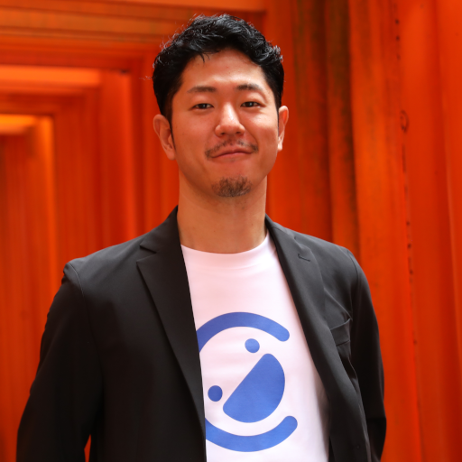
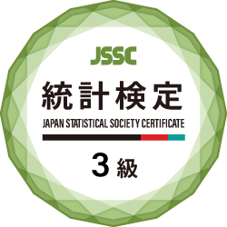
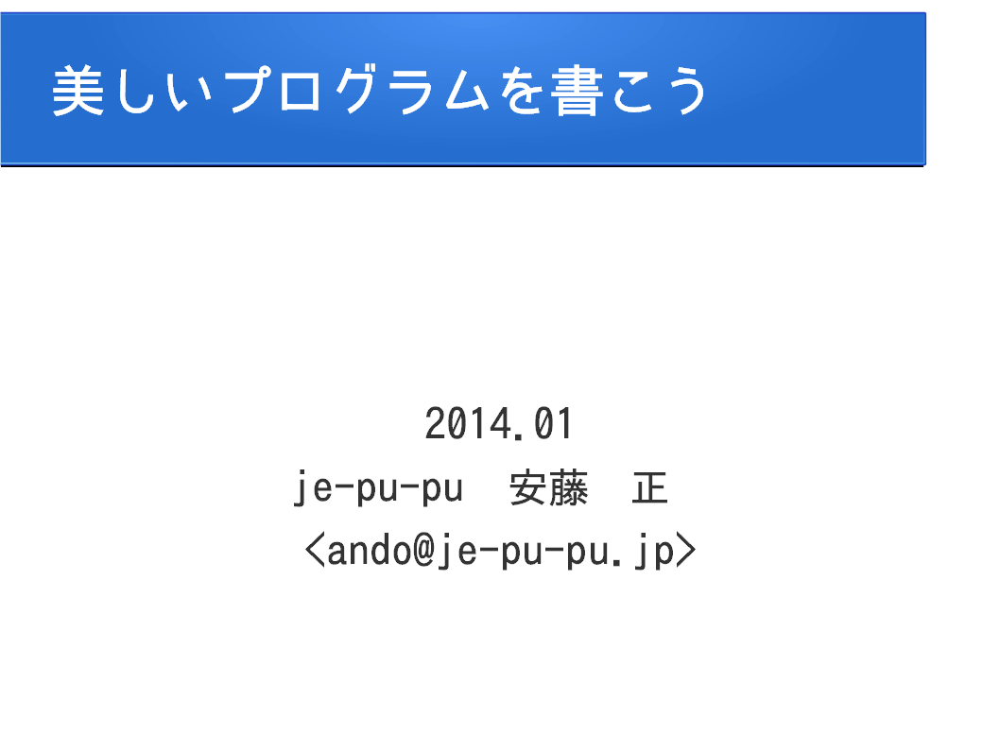

# 安藤 正 プロフィール

* 安藤 正 ( あんどう ただし )
* 1983 年愛媛県生まれ
* 18 歳で京都のゲーム会社に就職
* 20 歳でフリーランスとして独立
    * システム開発
* 2019 年 株式会社エクスペリメンタルを設立し代表取締役に就任
    * Webシステム・業務システム開発
* 2025 年 株式会社 Field を設立し代表取締役に就任
    * システム開発・ AI 活用

「脳で奏でる音楽」など
ちょっと変わったものを作るのが好き

* [イラスト](image.md)
* [写真](photo.md)

# 資格

# リンク

* [安藤 正 / JE（@je_pu_pu）さん / X](https://x.com/je_pu_pu)
* [GitHub je-pu-pu - Overview](https://github.com/je-pu-pu/)
* [@je-pu-puのマイページ - Qiita](https://qiita.com/je-pu-pu)
* [je-pu-pu（ジェーイープープー） サークルプロフィール | 作品一覧「DLsite 同人」](https://www.dlsite.com/home/circle/profile/=/maker_id/RG12705.html/?utm_medium=affiliate&utm_campaign=bnlink&utm_content=text)
* [SoundCloud](https://soundcloud.com/je-pu-pu)

* [JEの本棚 (JE) - ブクログ](https://booklog.jp/users/je-pu-pu)

* [株式会社エクスペリメンタル - 株式会社エクスペリメンタルの公式サイト](https://www.experimental.co.jp/)
* [株式会社 Field | システム開発](https://field-company.co.jp/)

# 美しいプログラムを書こう

